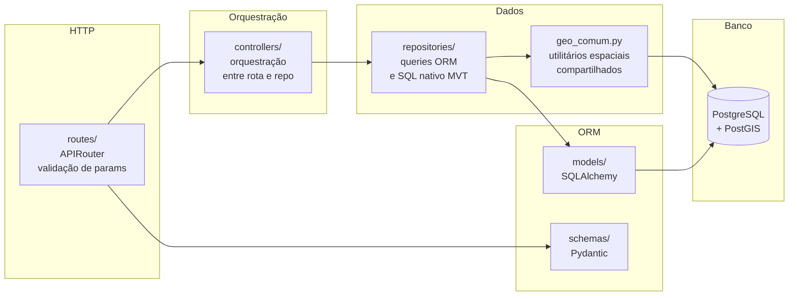
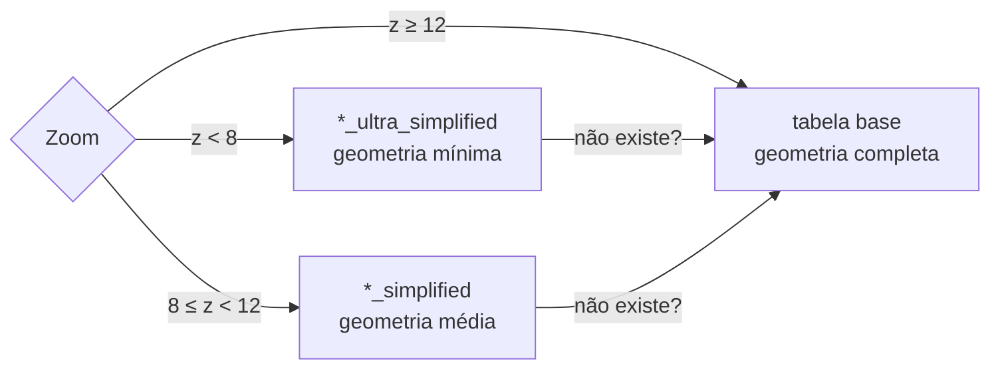
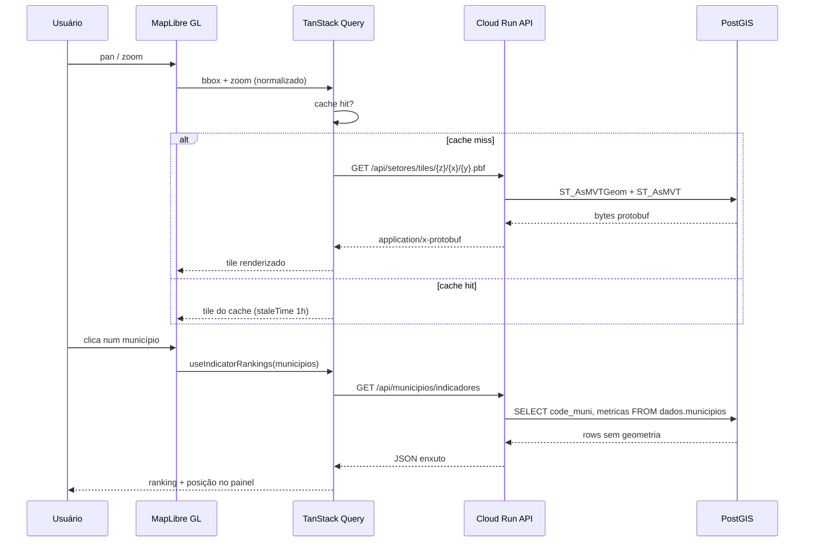
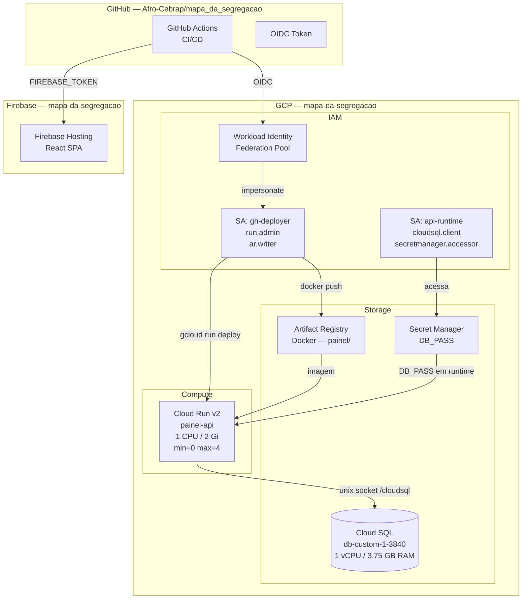
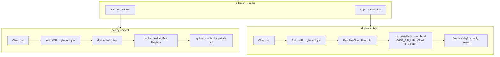
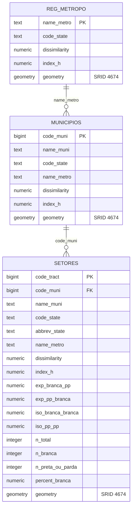
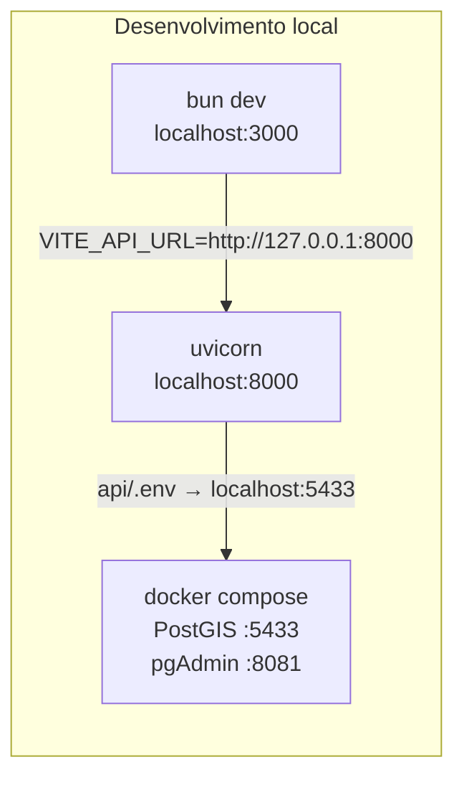

# Arquitetura — Mapa da Segregação

## Visão geral

O sistema é composto por três camadas independentes:

| Camada | Tecnologia | Hospedagem |
|---|---|---|
| Frontend | React 19 + Vite + MapLibre GL | Firebase Hosting |
| API | FastAPI + SQLAlchemy + GeoAlchemy2 | Cloud Run (GCP) |
| Banco | PostgreSQL 15 + PostGIS | Cloud SQL (GCP) |

---

## 1. Arquitetura do sistema

```mermaid
graph TB
    subgraph Cliente
        U((Usuário))
        B[Navegador\nMapLibre GL]
    end

    subgraph Firebase["Firebase Hosting"]
        SPA["React SPA\n(bundle estático)"]
    end

    subgraph CloudRun["Cloud Run — painel-api"]
        API["FastAPI\n(uvicorn)"]
    end

    subgraph CloudSQL["Cloud SQL"]
        PG[(PostgreSQL 15\n+ PostGIS)]
        subgraph Tabelas
            S[dados.setores\n316k linhas]
            M[dados.municipios\n5.5k linhas]
            R[dados.reg_metropo\n39 linhas]
            SS[dados.setores_*_simplified]
        end
    end

    U --> B
    B -->|HTTPS — assets| SPA
    B -->|REST JSON| API
    B -->|Protobuf /tiles/{z}/{x}/{y}.pbf| API
    API -->|SQL espacial| PG
```

---

## 2. Backend — camadas internas

A API segue arquitetura em camadas com separação clara de responsabilidades.



### Rotas disponíveis

| Prefixo | Recurso | Endpoints principais |
|---|---|---|
| `/api/setores` | Setores censitários (316k) | `/viewport`, `/tiles/{z}/{x}/{y}.pbf`, `/indicadores`, `/escala` |
| `/api/municipios` | Municípios (5.5k) | `/`, `/lista`, `/viewport`, `/tiles/{z}/{x}/{y}.pbf`, `/indicadores` |
| `/api/reg_metro` | Regiões metropolitanas (39) | `/`, `/viewport`, `/tiles/{z}/{x}/{y}.pbf`, `/indicadores` |

### Resolução de tabela por zoom



---

## 3. Frontend — fluxo de dados do mapa



### Normalização da cache key

O hook `useSetoresViewport` agrupa o bbox por precisão de acordo com o zoom antes de montar a query key, evitando cache miss em micro-pans:

| Zoom | Precisão do bbox |
|---|---|
| < 8 | 0 casas decimais |
| 8–11 | 1 casa decimal |
| ≥ 12 | 3 casas decimais |

---

## 4. Infraestrutura GCP



### Recursos provisionados pelo Terraform

| Recurso | Nome | Custo estimado |
|---|---|---|
| Cloud SQL | `painel-segreg-pg` (db-custom-1-3840) | ~$51/mês |
| Cloud Run | `painel-api` | ~$0–5/mês |
| Artifact Registry | `painel` | ~$0.10/mês |
| Firebase Hosting | — | $0 (free tier) |
| Secret Manager | `db-password` | ~$0.06/mês |
| **Total** | | **~$52–57/mês** |

---

## 5. CI/CD — pipelines



> **Nota:** O Firebase Hosting usa `secrets.FIREBASE_TOKEN` (refresh token de CI via `firebase login:ci`), pois o firebase-tools não aceita credenciais WIF (`external_account`). O gcloud é autenticado via WIF apenas para resolver a URL do Cloud Run antes do build.

---

## 6. Banco de dados — schema e tabelas



### Tabelas de zoom simplificadas

Criadas por `data/simplify_table.py` e resolvidas em runtime por `geo_comum.resolver_tabela_por_zoom`:

| Tabela | Zoom alvo | Tolerância |
|---|---|---|
| `dados.setores` | z ≥ 12 | geometria original |
| `dados.setores_simplified` | 10 ≤ z < 12 | simplificada |
| `dados.setores_ultra_simplified` | z < 10 | muito simplificada |
| `dados.municipios` | todos os zooms | geometria original (~5.5k) |
| `dados.reg_metropo_simplified` | z < 12 | simplificada |

---

## 7. Ambiente local



### Comandos

```bash
# Backend
cd api
docker compose up -d
venv1\Scripts\python -m uvicorn app:app --reload --host 127.0.0.1 --port 8000

# Frontend
cd app
bun install
bun dev

# Testes
cd api
venv1\Scripts\python -m pytest tests -v
```
