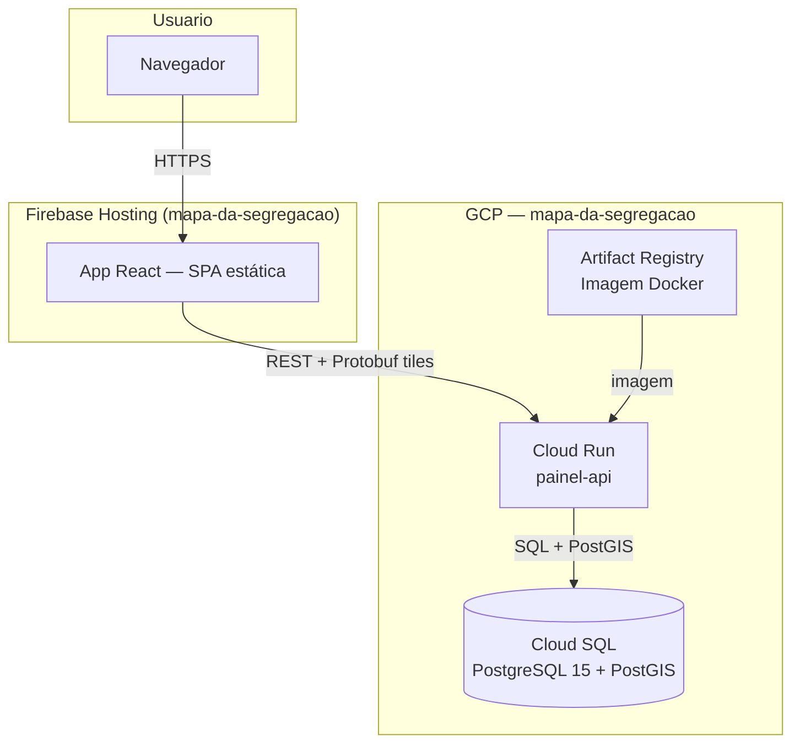

# Mapa da Segregação

Painel interativo de indicadores de segregação racial no Brasil, com visualização cartográfica por setor censitário, município e região metropolitana.

- **Frontend:** https://mapa-da-segregacao.web.app
- **API:** https://painel-api-2olyn5cqxq-uc.a.run.app/docs

## Repositórios

| Repositório | Conteúdo |
|---|---|
| `Afro-Cebrap/mapa_da_segregacao` | Este repo — monorepo com API, frontend e infraestrutura |

## Estrutura do monorepo

```
api/        FastAPI backend (Python) — tiles vetoriais e dados de segregação
app/        React 19 + TypeScript + Vite — frontend estático
deploy/     Infraestrutura como código (Terraform) e scripts de ingestão
.github/    Pipelines de CI/CD (GitHub Actions)
docs/       Documentação e especificações técnicas
```

## Arquitetura



## Deploy rápido

```bash
# Infraestrutura (primeira vez ou ao mudar terraform.tfvars)
cd deploy/gcp/terraform
terraform init && terraform apply

# CI/CD automático após push
git push origin main   # api/** → Cloud Run | app/** → Firebase
```

Documentação completa: [`docs/architecture.md`](docs/architecture.md)
