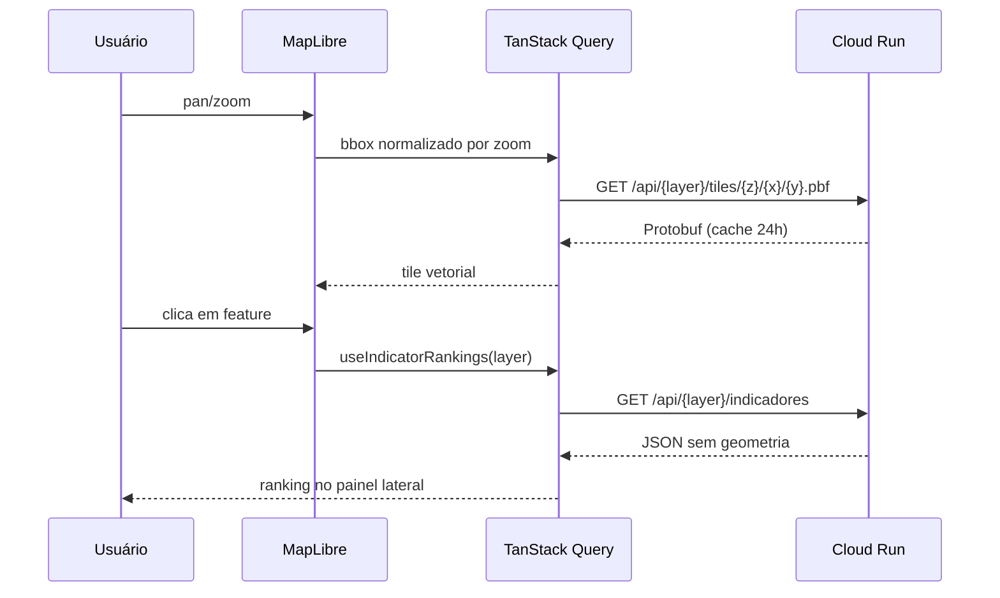

# Frontend — Mapa da Segregação

React 19 + TypeScript + Vite. Deploy estático via Firebase Hosting.

**Produção:** https://mapa-da-segregacao.web.app

## Stack

- React 19, TypeScript, Vite
- Bun (package manager — não use npm/yarn)
- MapLibre GL via `@vis.gl/react-maplibre` (tiles vetoriais)
- TanStack Query (cache de requisições)
- Axios (cliente HTTP)
- Tailwind CSS 4 + Radix UI / shadcn
- React Router v7

## Desenvolvimento

```bash
cd app
bun install
bun dev          # http://localhost:3000
bun run build    # dist/
bun run preview  # serve dist/ localmente
bun run lint
bun run format
```

## Variáveis de ambiente

```env
# app/.env.local
VITE_API_URL=http://127.0.0.1:8000   # padrão em dev
```

Em produção, `VITE_API_URL` é injetado pelo CI com a URL do Cloud Run antes do `bun run build`.

## Estrutura

```
src/
├── App.tsx              # Providers: TanStack Query, ThemeProvider, Router
├── Routes.tsx           # Rotas: / e /dashboard (lazy) + NotFound
├── pages/
│   ├── Home.tsx         # Landing page
│   └── Dashboard.tsx    # Mapa interativo
├── components/
│   ├── dashboard/       # DashboardMap, Sidebar, IndicatorRanking, PlaceDetails…
│   ├── layouts/         # MainLayout, DashboardLayout
│   └── ui/              # Radix UI / shadcn primitives
├── hooks/
│   ├── useSetores.ts    # TanStack Query — viewport + indicadores
│   ├── useIndicatorRankings.ts  # Ranking client-side por camada
│   └── useLocationLookups.ts   # Cache de municípios (lista leve)
├── services/
│   ├── api.ts           # Axios instance (VITE_API_URL + auth)
│   └── setores/         # Wrappers tipados para todos os endpoints
├── constants/
│   └── layers.ts        # Config das 3 camadas (setores/municípios/RMs)
└── lib/
    ├── mapFilters.ts    # resolveAllowedMunis — escopo do ranking
    └── format.ts        # formatNumber, formatPercent
```

## Fluxo do mapa



## Páginas

| Rota         | Componente      | Descrição                              |
| ------------ | --------------- | -------------------------------------- |
| `/`          | `Home.tsx`      | Landing page institucional             |
| `/dashboard` | `Dashboard.tsx` | Mapa + sidebar + toolbox (lazy loaded) |
| `*`          | `NotFound.tsx`  | 404                                    |

## Deploy

O CI injeta `VITE_API_URL` automaticamente antes do build. Para deploy manual:

```bash
cd app
VITE_API_URL=https://painel-api-2olyn5cqxq-uc.a.run.app bun run build
firebase deploy --only hosting --project mapa-da-segregacao
```
