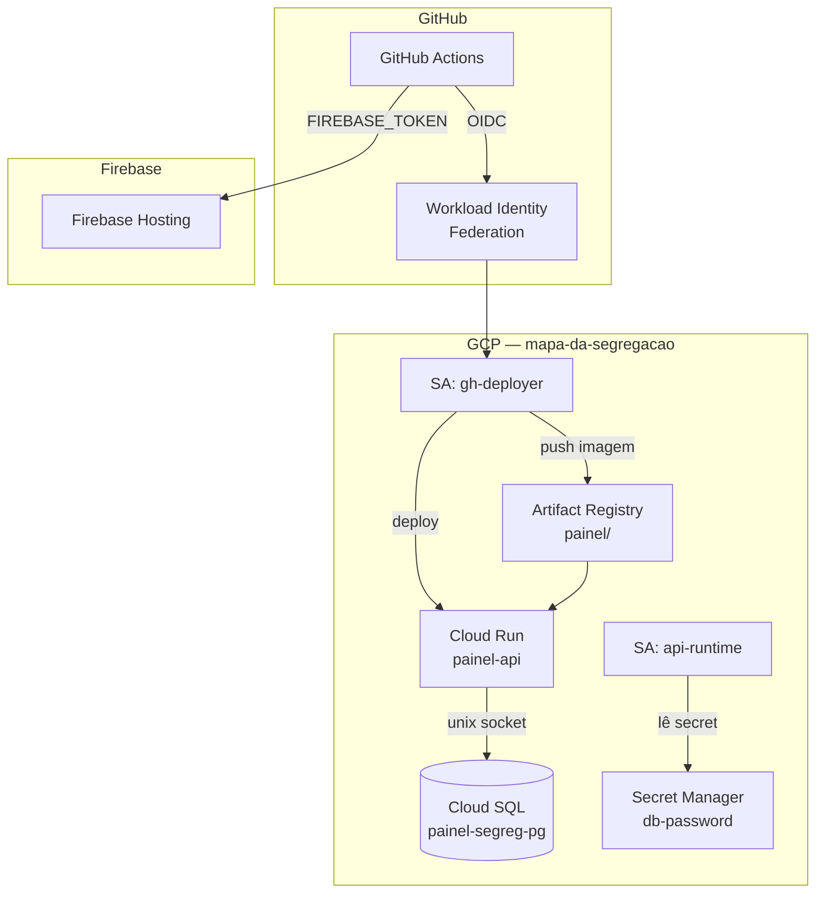

# Infraestrutura GCP — Mapa da Segregação

Deploy serverless: Cloud SQL (banco) + Cloud Run (API) + Firebase Hosting (frontend).

## Projetos GCP

| Projeto | Conteúdo |
|---|---|
| `mapa-da-segregacao` | Cloud SQL, Cloud Run, Artifact Registry, WIF, Secret Manager |
| `mapa-da-segregacao` | Firebase Hosting (mesmo projeto) |

## Arquitetura de infra



## Provisionar / atualizar infra

```bash
cd deploy/gcp/terraform
terraform init
terraform plan
terraform apply
```

Após o apply, configurar as variáveis no GitHub com os outputs:

```bash
terraform output -json github_repo_variables
```

## Variáveis GitHub Actions configuradas

| Variável | Valor |
|---|---|
| `GCP_PROJECT_INFRA` | `mapa-da-segregacao` |
| `GCP_REGION` | `us-central1` |
| `WIF_PROVIDER` | `projects/620861699805/.../github-provider` |
| `DEPLOY_SA_EMAIL` | `gh-deployer@mapa-da-segregacao.iam.gserviceaccount.com` |
| `AR_REPO` | `painel` |
| `RUN_SERVICE` | `painel-api` |
| `FIREBASE_PROJECT` | `mapa-da-segregacao` |

Secret `FIREBASE_TOKEN`: refresh token gerado via `firebase login:ci`.

## CI/CD automático

```
push api/**   →  deploy-api.yml   →  Cloud Run
push app/**   →  deploy-web.yml   →  Firebase Hosting
```

Ambos os workflows suportam `workflow_dispatch` para disparo manual.

## Ingestão de dados

Quando o parquet mudar, rodar via Cloud SQL Auth Proxy:

```bash
./deploy/gcp/ingest-local.sh
```

O script usa as credenciais do `gcloud` local e conecta ao Cloud SQL sem expor a porta publicamente.

## Alterar projeto GCP ou repositório

1. Editar `deploy/gcp/terraform/terraform.tfvars`
2. `terraform apply`
3. Atualizar variáveis no GitHub com `terraform output github_repo_variables`
4. Se trocou o repositório, mover os workflows para o novo repo e recriar o secret `FIREBASE_TOKEN`

## Estado do Terraform

Estado local (`terraform.tfstate`) por padrão. Para ambientes de time, migrar para backend GCS:

```hcl
# deploy/gcp/terraform/main.tf — descomentar e criar o bucket antes
backend "gcs" {
  bucket = "mapa-da-segregacao-tfstate"
  prefix = "deploy/gcp"
}
```

## Custos estimados

| Recurso | ~$/mês |
|---|---|
| Cloud SQL db-custom-1-3840 | $51 |
| Cloud Run (escala a zero) | $0–5 |
| Artifact Registry | $0.10 |
| Firebase Hosting | $0 |
| **Total** | **~$52–57** |
